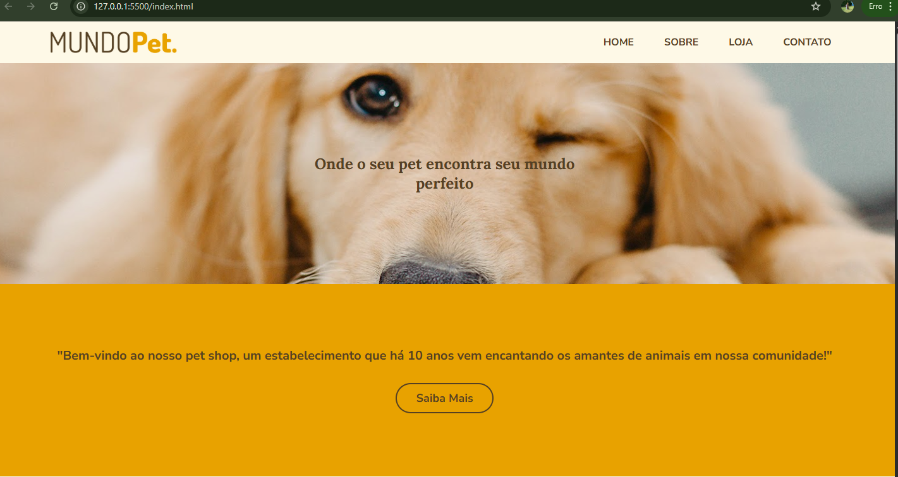
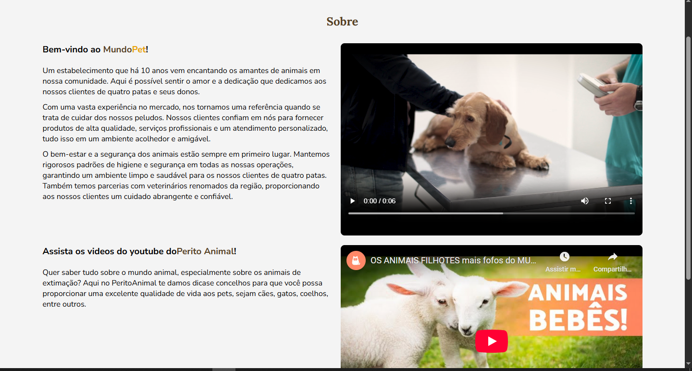
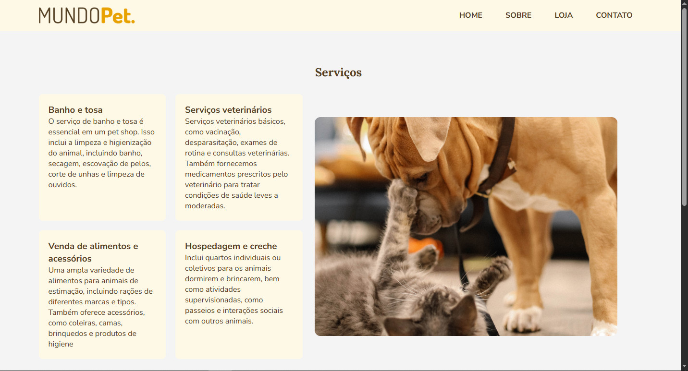
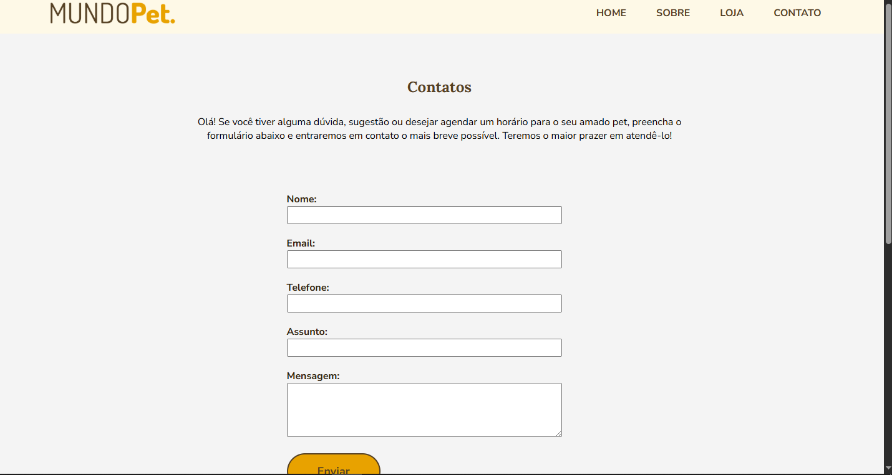

#  Mundo Pet

Este é um projeto de site fictício para um pet shop, feito com HTML e CSS,
desenvolvido pelo SENAI PLAY e adaptado para ser responsivo

##  Páginas desenvolvidas:
- `index.html` – Página inicial
- `sobre.html` – Sobre a empresa
- `loja.html` – Produtos e serviços
- `contato.html` – Formulário e localização

##  Tecnologias Utilizadas:
- `HTML5`
- `CSS3`
- `Flexbox`
- `Google Fontsv
- `Responsividade com @media`
- `Git &amp; GitHub`

##  Aluno:
- Nome: [Lucas]

---

## ��️ Prints do site (inserir abaixo):

